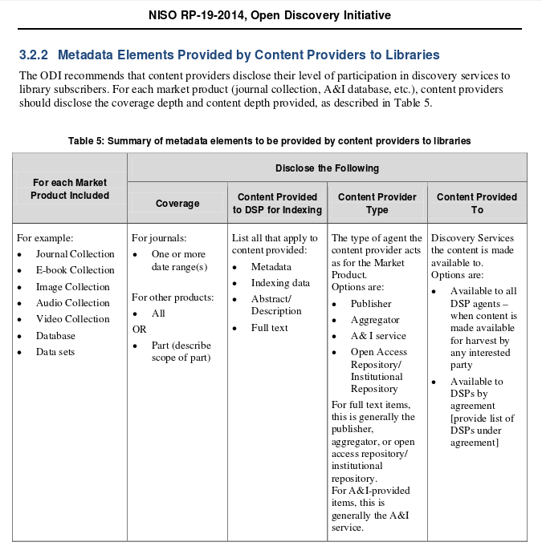

# Open Discovery Initiative

## NISO Open Discovery Initiative
* Standardisierungsgremium in den USA
* Arbeitsgruppe ["Open Discovery Initiative (ODI)"](http://www.niso.org/workrooms/odi/)
* NISO RP-19-2014: A Recommended Practice of the  National Information Standards Organization

## Auszug aus dem Papier (S. 20)
http://www.niso.org/workrooms/odi/publications/rp/rp-19-2014

## Kernpunkte
* ...

