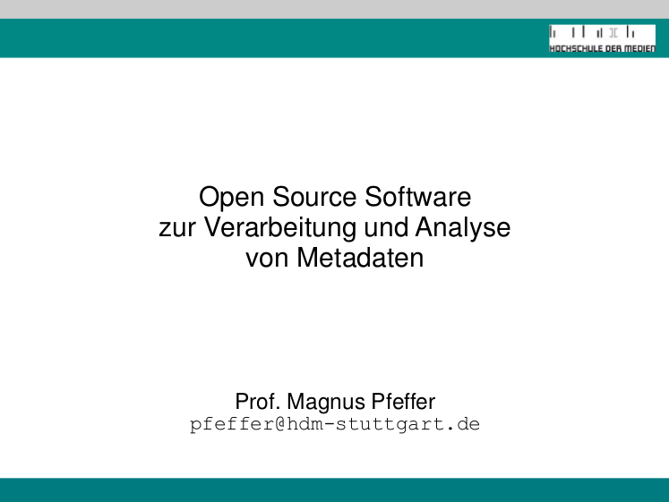

# 2.2 Open Source Software zur Verarbeitung und Analyse von Metadaten

## Präsentation Magnus Pfeffer (2016)

Prof. Magnus Pfeffer (2016): Open Source Software zur Verarbeitung und Analyse von Metadaten. Präsentation auf dem 6. Bibliothekskongress. http://nbn-resolving.de/urn/resolver.pl?urn:nbn:de:0290-opus4-24490

## Kernpunkte

Der erste Schritt zum selbstentwickelten Bibliothekskatalog ist die Analyse und Verarbeitung der Metadaten. Welche Medien sollen im Katalog angezeigt werden und welche Daten liegen dazu bereits vor? Oftmals müssen die beschreibenden Daten über die Objekte (Metadaten) erst aufbereitet werden, um sie in einen Suchmaschinenindex laden zu können.

Aufgrund der zunehmenden Komplexität an Datenformaten, Regelwerken und Datenquellen ist eine ganze Reihe von Open Source Werkzeugen entstanden. Magnus Pfeffer stellt in seiner Präsentation die Vielfalt der verfügbaren Software dar, die sich zum Einsatz in der Lehre eignet.

Die einzusetzende Software sollte für den Zweck der Lehre drei Arbeitsschritte ermöglichen (das gilt auch für dieses Seminar):
1. Validierung und einfache Analyse von Datenlieferungen (z.B. konsistente Feldbelegungen, Erkennen von Unstimmigkeiten, statistische Analysen)
2. Anpassung von Datenlieferungen (Filtern von Datensätzen, Anpassen einzelner Felder)
3. Durchführen eines ETL-Prozesses ([Extract, Transform, Load](https://de.wikipedia.org/wiki/ETL-Prozess): Daten aus dem Bibliothekssystem extrahieren, anpassen und in einen Suchindex laden)

Magnus Pfeffer unterscheidet drei Kategorien von Software:
* Einzelne Programme: MABLE+/MARCEL, MAB-Tools, MARCTools, MarcEdit usw.
* Toolkits: Metafacture, Catmandu, MarcXimiL
* Web-basierte Software: OpenRefine, d:swarm

Schwierigkeiten für den Einsatz in der Lehre bestehen darin, dass oftmals die Dokumentation nicht für Einstieger geeignet ist, teilweise sehr spezielle Systemvoraussetzungen bestehen, die Anwendungen teilweise frustrierend zu bedienen sind und realistische Workflows nur mit Kombinationen von unterschiedlichen Programmen umsetzbar sind. Im Modul Metadatenmanagement an der HDM Stuttgart plant er daher typische Workflows mit der Software Librecat/Catmandu und OpenRefine nachzustellen.

## Was bedeutet das für dieses Seminar?

Es gibt zahlreiche Profi-Software, die für die Aufbereitung der Metadaten zum Einsatz kommen kann.

In diesem Seminar (zum Bau eines Bibliothekskatalogs) bietet sich besonders OpenRefine an, weil das Programm vergleichsweise einfach zu bedienen ist, eine grafische Oberfläche bietet und Transformationsergebnisse direkt sichtbar werden. Gleichzeitig ist es ein vielgenutztes Werkzeug auch über die Bibliothekscommunity hinaus (z.B. im Datenjournalismus beliebt) und somit vielfältig einsetzbar.

Im konkreten Arbeitsalltag in den IT-Abteilungen der Bibliotheken kommt je nach Anwendungsfall und Vorliebe des Personals oft spezialisierte Software zum Einsatz. Die Arbeitsprozesse sind aber ähnlich und lassen sich am Beispiel von OpenRefine gut erlernen.