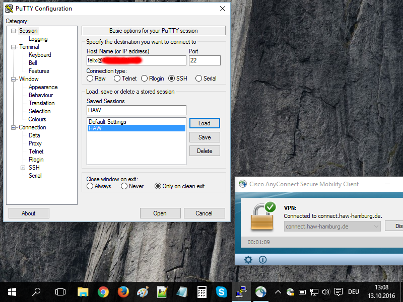

# 3.3 Verbinden mit dem Server über SSH

In diesem Seminar verbinden wir uns von unseren Rechnern (auf denen z.B. Windows läuft) mit dem Linux-Webserver. Für die Verbindung nutzen wir das SSH-Protokoll, damit die Verbindung vollständig verschlüsselt wird. Wenn wir uns über SSH mit dem Linux-Webserver verbinden, dann bekommen wir die Kommandozeile von Linux angezeigt und können auf dem Linux-Webserver arbeiten, als wir ob direkt davor sitzen.

## Schritt 1: Verbinden

### mit Windows
Verbinden mit dem Server über SSH-Protokoll mit der kleinen Software [Putty](http://www.putty.org):
* putty.exe von http://www.putty.org herunterladen und ausführen
* in das Feld "Host name" Benutzername@IP-Adresse eintragen (Beispiel: ```felix@192.168.1.1```)
* SSH-Verbindung starten
* Kopieren und einfügen funktioniert bei Putty etwas anders als gewohnt. Das Einfügen aus der Zwischenablage erfolgt über einen einfachen *Rechtsklick*, es gibt kein Kontextmenü wie sonst unter Windows. Siehe dazu auch: https://kb.site5.com/shell-access-ssh/putty/putty-how-to-copy-and-paste-to-and-from-a-putty-window/



### mit Linux
* Terminal aufrufen
* ssh *user*@*ip* (Beispiel: ```ssh felix@192.168.1.1```)
* siehe auch: https://wiki.ubuntuusers.de/SSH/#Der-SSH-Client

### mit Mac OS X
* Terminal aufrufen
* ssh *user*@*ip* (Beispiel: ```ssh felix@192.168.1.1```)
* siehe auch: http://macs-moritz.com/ssh-verbindung-via-terminal-unter-mac-os-x

### über die Web Shell von TurnKey Core
Wenn Sie in Schritt 3.1 TurnKey Core installiert haben, dann können Sie in den folgenden Übungen auch die bekannte Web Shell aufrufen:

    https://192.168.1.1:12320

192.168.1.1 durch die IP-Adresse ersetzen und Warnmeldung zu ungültigen SSL-Zertifikatswarnung ingnorieren bzw. Ausnahmeregelung einrichten.

Im Firefox-Browser gibt es Schwierigkeiten einige Sonderzeichen wie ```|``` einzugeben. Verwenden Sie bei Bedarf stattdessen den Chrome-Browser.

## Schritt 2: Neues Passwort setzen

1. Sicheres Passwort unter http://passwordsgenerator.net generieren (Empfehlung: Checkbox "Exclude Ambiguous Characters" aktivieren, das macht es leichter das Passwort einzutippen)
2. Passwort setzen mit dem Befehl ```passwd```