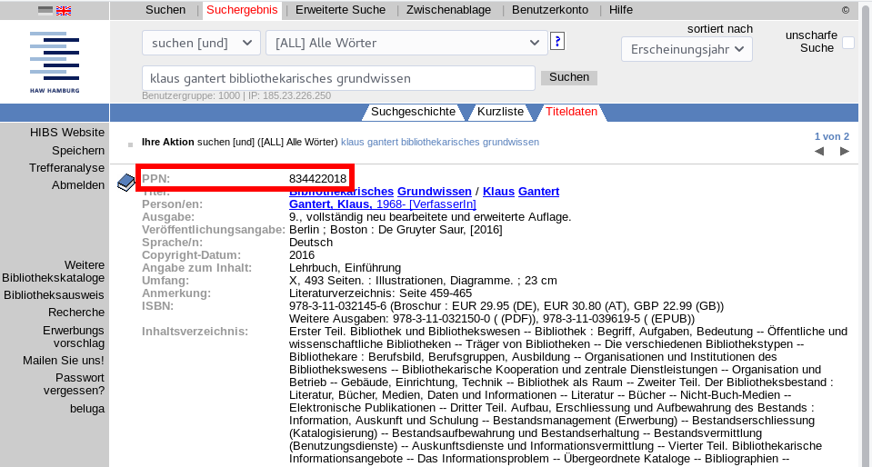

# 4.2 Übung: unAPI-Schnittstelle des GBV

Die Verbundzentrale des Bibliotheksverbunds GBV bietet mehrere Schnittstellen, die einen Abruf einzelner Datensätze erlauben. Wir nutzen für diese Übung die sogenannte "unAPI".

Dokumentation der unAPI-Schnittstelle des GBV: https://www.gbv.de/wikis/cls/unAPI

Für den Abruf von Datensätzen über die unAPI wird die jeweilige Identifikationsnummer des Datensatzes (in den Bibliothekssystemen des GBV "PPN" genannt) benötigt. Diese wird im Bibliothekskatalog angezeigt.



## Aufgabe: Download mit curl

Lesen Sie die Dokumentation im Wiki des GBV und laden Sie mit dem Programm **curl** und der dort dokumentierten Beispielanfrage
```
http://unapi.gbv.de/?id=gvk:ppn:56677741X&format=mods
```
die Metadaten für einen beliebigen Katalogdatensatz der HAW-Bibliothek in allen vom GBV angebotenen Formaten (PICA+, PICA-XML, MARC21, etc.).

**Hinweise:**
* Sie können die Anfragen auch direkt in einem Browser aufrufen.
* Die http-Adresse müssen Sie bei **curl** in Anführungszeichen setzen, weil das Format mit einem &-Symbol übergeben wird, das sonst als Steuerzeichen interpretiert wird.
```
curl "http://..."
```
* Zum Speichern der Ausgabe als Datei können Sie am Ende des Befehls Folgendes anfügen (funktioniert für viele Linux-Programme):
```
> dateiname.txt
```

## Lösung

Beispiel:
* PPN: 834422018
* ID des Katalogs beim GBV: opac-de-18-302 (Katalog der HAW-Bibliothek)

### PICA+
curl "http://unapi.gbv.de/?id=opac-de-18-302:ppn:834422018&format=pp" > 834422018.pp

### PICA-XML
curl "http://unapi.gbv.de/?id=opac-de-18-302:ppn:834422018&format=picaxml" > 834422018.picaxml

### MARC21
curl "http://unapi.gbv.de/?id=opac-de-18-302:ppn:834422018&format=marc21" > 834422018.marc21

### Weitere Formate
* MARCXML: curl "http://unapi.gbv.de/?id=opac-de-18-302:ppn:834422018&format=marcxml" > 834422018.marcxml
* MODS: curl "http://unapi.gbv.de/?id=opac-de-18-302:ppn:834422018&format=mods" > 834422018.mods
* DC: curl "http://unapi.gbv.de/?id=opac-de-18-302:ppn:834422018&format=dc" > 834422018.dc
* ISBD: curl "http://unapi.gbv.de/?id=opac-de-18-302:ppn:834422018&format=isbd" > 834422018.isbd
* PICA+ als HTML: curl "http://unapi.gbv.de/?id=opac-de-18-302:ppn:834422018&format=picahtml" > 834422018.html