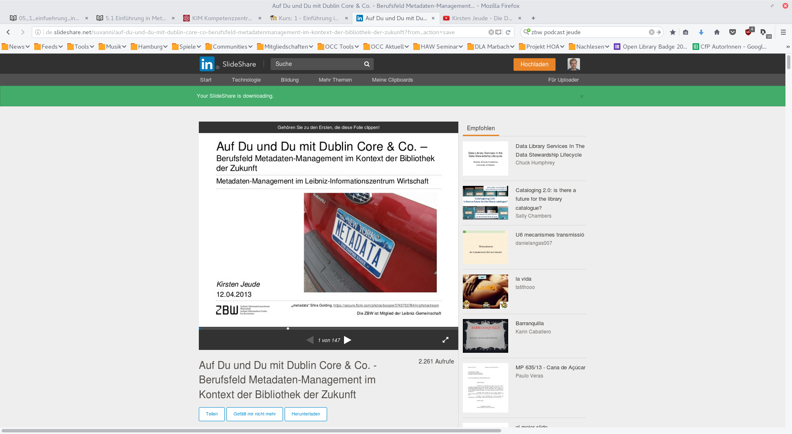

# 5.1 Einführung in Metadatenformate

## Präsentation Kisten Jeude (2013)

http://www.slideshare.net/suvanni/auf-du-und-du-mit-dublin-core-co-berufsfeld-metadatenmanagement-im-kontext-der-bibliothek-der-zukunft

## Interview mit Kirsten Jeude
ZBW Podcast: ["Kirsten Jeude - Die Datenübersetzerin"](https://www.youtube.com/watch?v=YwbRTDvt_sA)

## Literatur
* Wikipedia zu Metadaten: https://de.wikipedia.org/wiki/Metadaten
* Onlinetutorial "Einführung in Metadaten und Metadatenformate" von Claudia Effenberger und Stefanie Rühle: http://moodle.dnb.de/course/view.php?id=14
* Kleines Handbuch der DINI AG KIM: http://www.kim-forum.org/Subsites/kim/DE/Materialien/Handbuch/handbuch_node.html