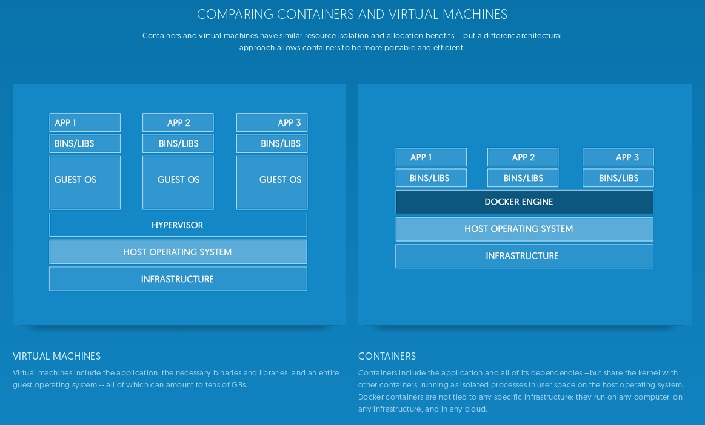

# 6.1 Installation Docker

## Container-Lösungen am Beispiel von Docker

Unterschied zwischen Virtualisierung (beispielsweise mit Virtualbox, vgl. Kapitel 3.1) und Container-Lösungen (wie z.B. Docker)

[](https://www.docker.com/what-docker)

Beides lässt sich kombinieren: Wir installieren Docker innerhalb der virtuellen Maschine (VM).

Literatur:
* Docker und mehr: Was zur Hölle sind eigentlich Container? http://t3n.de/news/was-sind-container-756373
* Alternativen zu Docker: http://www.linux-magazin.de/Ausgaben/2015/05/LXD

## Installation von Docker auf der VM

Die Installation von Docker auf der in Kapitel 3.1 eingerichteten VM gestaltet sich einfach. Es kann der normalen Installationsanleitung für Debian Server gefolgt werden:
https://docs.docker.com/engine/installation/linux/debian/

Test: ```sudo docker run hello-world```
